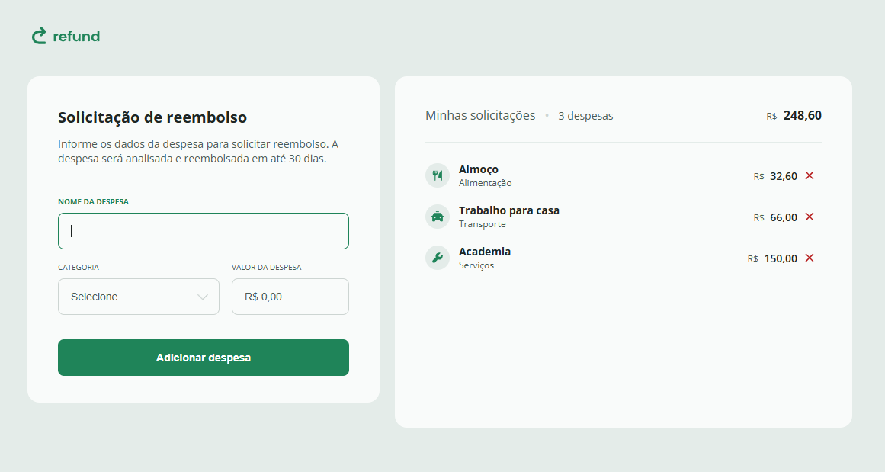

# Expense Tracker 💰  

This project is an **expense tracker** built with **HTML, CSS, and JavaScript**. It allows users to dynamically add, view, and remove expenses.  

## 🚀 Stack  

### 🔹 JavaScript  
- **Objects** – Uses objects to store expense data.  
- **Text methods** – String manipulation for currency formatting.  
- **DOM manipulation** – Selecting, creating, and modifying DOM elements.  
- **Flow control and error handling** – Implements `try...catch`, conditional structures, and loops.  
- **Form interaction** – Captures and handles form events (`onsubmit`, `oninput`).  
- **CSS elements manipulation** – Dynamically modifies element classes and styles.  

### 🎨 CSS  
- **Responsive design** – Supports various screen sizes using media queries.  
- **Custom input and button styling** – Well-styled form elements, buttons, and scrollbar.  
- **Animations and transitions** – Visual effects on hover interactions.  

### 📄 HTML  
- **Semantic structure** – Uses proper tags for accessibility and content organization.  
- **Interactive forms** – Input fields for expenses and categories.  
- **Dynamic lists** – Real-time updating of expense items.  

## 📸 Project Screenshot  

  